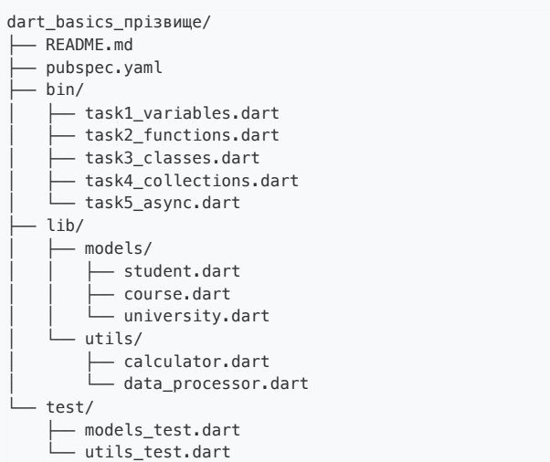
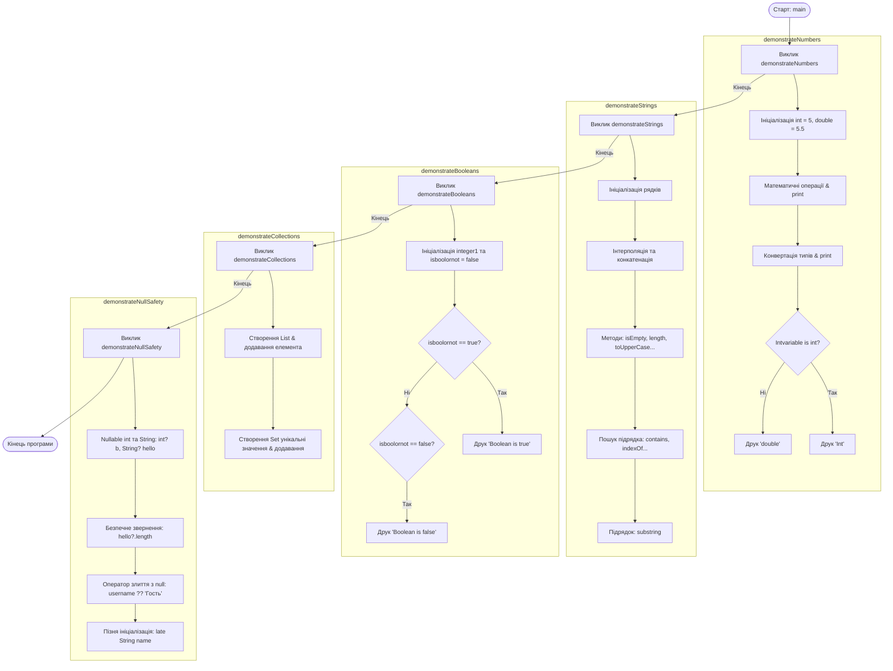

# Практична робота 4: Основи мови Dart

## Завдання 1: Налаштування проекту та основи синтаксису
### Опис структури проекту
Була створена структура проекту, яка містить:



* **`README.md`**  опис завдань, інструкції.
* **`pubspec.yaml`**  технічне налаштування проекту.
* **`bin/`**  містить завдання 1-5:
  * `task1_variables.dart`  завдання 1.
  * `task2_functions.dart`  завдання 2.
  * `task3_classes.dart`  завдання 3.
  * `task4_collections.dart`  завдання 4.
  * `task5_async.dart`  завдання 5.
* **`lib/`**  містить папку `models/` та `utils/`:
  * `models/student.dart`  клас студента.
  * `models/course.dart`  клас курсів.
  * `models/university.dart`  клас університету (також містить клас професора та базовий клас людини).
  * `utils/calculator.dart`  програма калькулятор.
  * `utils/data_processor.dart`  тестування data processor.
* **`test/`**  містить тести:
  * `models_test.dart`  тест 1.
  * `utils_test.dart`  тест 2.

#### Блок-схема виконання (`task1_variables.dart`)

---
## Завдання 2: Змінні, типи даних та функції
### 2.1. Змінні та типи даних (`task1_variables.dart`)

* **Опис:** Був заповнений файл `bin/task1_variables.dart`, що демонструє роботу зі змінними.
* **Інструкція:** Відкрити файл `task1_variables.dart`, відкрити термінал, ввести `dart run bin/task1_variables.dart`. Подивитися консоль.
```mermaid
    Start([Старт: main]) --> M1[Виклик calculateSum 10, 20]

    subgraph CalcSum [calculateSum]
        M1 --> CS1[Друкує суму a + b та повертає її]
    end

    M1 --> M2[Виклик calculateAverage 10.0, 20.0, 30.0, 40.0]

    subgraph CalcAvg [calculateAverage]
        M2 --> CA1[Рахує суму елементів у циклі]
        CA1 --> CA2[Ділить на довжину списку]
        CA2 --> CA3[Друкує та повертає середнє значення]
    end

    M2 --> M3[Виклик formatName: Іван, Петренко]

    subgraph FormatName [formatName]
        M3 --> FN1[Формує список parts: прізвище, ім'я]
        FN1 --> FN2{middleName є?}
        FN2 -- Так --> FN3[Додає middleName до parts]
        FN2 -- Ні / Після --> FN4[Об'єднує через пробіл]
        FN4 --> FN5{uppercase == true?}
        FN5 -- Так --> FN6[Переводить у UPPERCASE]
        FN5 -- Ні / Після --> FN7[Повертає рядок]
    end

    M3 --> M4[Виклик formatName з middleName та uppercase]
    M4 --> M5[Виклик testFunctionalProgramming]

    subgraph FuncProg [testFunctionalProgramming]
        M5 --> FP1[Вкладена функція calculate додавання/множення]
        FP1 --> FP2[Колекції: where, map, fold]
        FP2 --> FP3[Замикання Closure: makeAdder]
    end

    M5 --> M6[Виклик factorial 4]

    subgraph FactFib [factorial та fibonacci]
        M6 --> F1[Рахує факторіал у циклі від 1 до n]
        F1 --> F2[Передає результат у fibonacci]
        F2 --> F3[Виконує формулу n-1 + n-2 та повертає значення]
    end

    FactFib --> End([Кінець програми])
